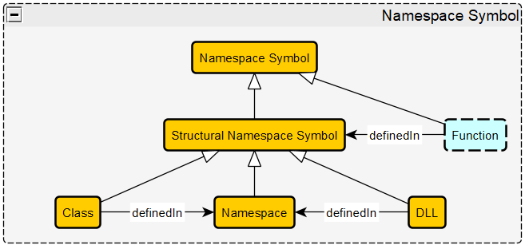
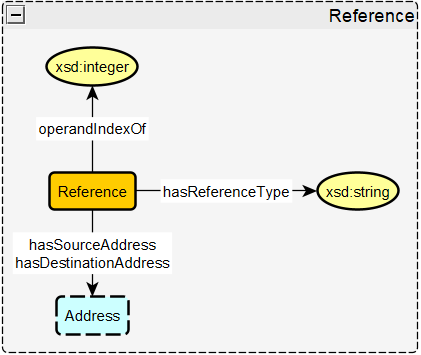
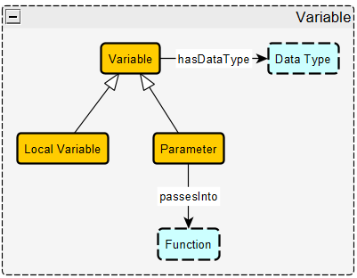
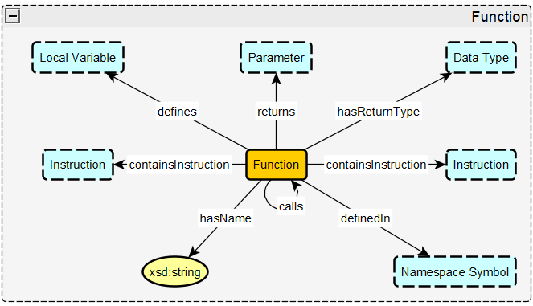
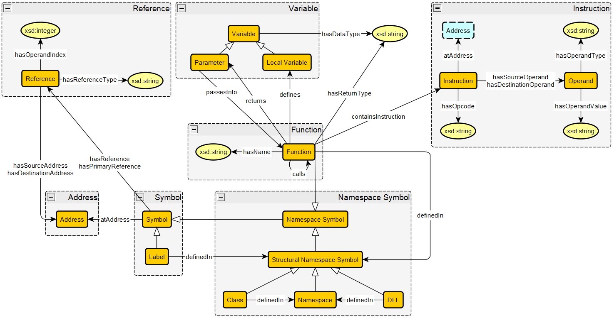

# Key Notions (Modules)

## Symbol
### Description
A symbol is a named entity in an executable file that is associated with a specific memory address. For this schema, the types of symbols include labels, then a sub class of symbol called namesapce symbol, which includes functions, classes, namespaces, and DLLs (dynamic link libraries). A symbol can have one or more references, but only one reference is designated as the primary reference. Each symbol is also associated with a memory address.  

### Axioms
* `(1) Symbol hasReference min 0 Reference`  
"A symbol has 0 or more references"
* `(2) Symbol hasPrimaryReference min 0 max 1 Reference`  
"A symbol has up to one primary reference"
* `(3) Symbol hasAddress min 0 max 1 Address`  
"A symbol is associated with up to one address"
* `Label subClassOf Symbol`  
"Every label is a symbol"
* `Namespace Symbol subClassOf Symbol`  
"Every namespace symbol is a symbol"
* `(4) Label definedIn Structural Namespace Symbol exactly 1 Namespace Symbol`  
"Every label is defined in exactly one structural namespace symbol" 

## Namespace Symbol
### Description
A namespace symbol is a kind of symbol in Ghidra that is used to organize other kinds of symbols. A function is a type of namespace symbol since it holds local variables. A further distinction is made called structural namespace symbols, which can hold more global namespaces and objects, like functions and labels. This means that classes, DLLs, and namespaces can all hold functions and labels. Ghidra does not support nested classes and nested functions within its decompilation, so those aspects are not represented in this schema. Classes and DLLs are also defined within a namespace, where all DLLs will be defined within the global namespace.

### Axioms
* `Structural Namespace Symbol subClassOf Namespace Symbol`  
"Every structural namespace symbol is a namespace symbol
* `Namespace subClassOf Structural Namespace Symbol`  
" Every namespace is a structual namespace symbol"
* `DLL subClassOf Namespace Symbol`  
"Every dll is a structural namespace symbol"
* `Function subClassOf namespace Symbol`  
"Every function is a namespace symbol"
* `Class subClassOf Namespace Symbol`  
"Every class is a structural namespace symbol"
* `(5) Class definedIn Namespace exactly 1 Namespace`  
"Every class is defined in exactly one namespace"
* `(6) DLL definedIn Namespace exactly 1 Namespace`  
"Every DLL is defined in exactly one namespace" (In this case, it will always be defined within the global namespace.)

## Reference
### Description
A reference is where two memory addresses interact with each other in some way, where one address uses another. This is used for things like when a function calls another function or when data is accessed by an instrution. References are 4-tuples, which include the source address, destination address, the type of reference (function call, data being accessed, etc.), and the operand index (which is an int that is either -1, 0, or 1).  

### Axioms
* `(7) Reference hasSourceAddress address exactly 1 sourceAddress`  
"A reference has exactly one source address"
* `(8) Reference hasDestinationAddress address exactly 1 destinationAddress`  
"A reference has exactly one destination address"
* `(9) Reference hasRefernceType xsd:string exactly 1 type`  
"A reference has exactly one reference type indicated by a string"
* `(10) Reference hasOperandIndex xsd:integer exactly 1 index`  
"A reference has exactly one operand index indicated by an integer"

## Variable
### Description
Variables in this context are tied to functions, and not a type of symbol itself. There are two types of variables in this schema: parameters, which are passed into and returned from functions, and local variables, which are defined locally within the function itself. Every variable has a data type associated with it.

### Axioms
* `(11) Variable hasDataType xsd:string 1 data type`  
" Every variable has exactly 1 data type represented as a string"
* `Local Variable subClassOf Variable`  
"Every local variable is a variable"
* `Parameter subClassOf Variable`  
"Every parameter is a variable"
* `(12) Parameter passesInto min 0 Function`  
"A parameter is passed into min 0 functions"

## Function
### Description
The Function objects keeps track of all the aspects of a function, including any functions it calls or functions called by it, the parameters passed in, the local variables defined in the function, the return type of the function, the return parameter of the function, the instructions the function contains, and what class the function is contained in (if any).  

### Axioms
* `(13) Function defines min 0 Local Variables`  
"A fuction can define 0 or more local variables"
* `(14) Function hasReturnType xsd:string min 0 max 1 datatype`  
"Every function has either no return type (void) or one return type represented as a string"
* `(15) Function returns min 0 max 1 Parameter`  
"Every function returns either no parameters or one parameter"
* `(16) Function calls min 0 Function`  
"A function can call 0 or more other functions"
(calledBy is the inverse of calls)
* `(17) Function definedIn Structural Namespace Symbol exactly 1 Structural Namespace Symbol`  
"Every function is defined within exactly one structural namespace symbol" (Ghidra only keeps track of one level of parent namespace.)
* `(18) Function containsInstruction min 1 Instruction`  
"A function contains one or more instructions"
* `(19) Function hasName xsd:string exactly 1 name`  
"A function has exactly one name represented as a string"

## Instruction
### Description
The instruction object refers to an assembly instruction that will originate from the disassembly acquired from Ghidra from a given executable file. An instruction includes one opcode, and zero or more operands, where registers, immediate operands (constant values), addresses, dynamic type objects, and scalars can play the role of an operand. These are assembly instructions that come from Ghidra's disassembly from an executable file. 

### Axioms
* `(20) Instruction hasOpcode xsd:string exactly 1 opcode`  
"Every instruction has exactly 1 opcode (represented as a string)"
* `(21) Instruction hasSourceOperand min 0 Operand`  
"Every instruction has 0 or more source operands"
* `(22) Instruction hasDestinationOperand min 0 max 1 Operand`  
"Every instruction has exactly 0 or 1 destination oeprands"
* `(23) Instruction atAddress exactly 1 Address`  
"Every instruction is located at exactly 1 (starting) address"
* `(24) Operand hasOperandType xsd:string exactly 1 type`  
"Every operand has exactly one type represented as a string" 
(Specifies the kind of object the operand is)
* `(25) Operand hasOperandValue xsd:string exactly 1 value`  
"Every operand has exactly one value represented as a string"

## Overall Schema Diagram
