<!-- 
Identify a thorough list of key notions.

    For each key notion, explain the rationale of why it is a key notion.
    For each key notion or set of key notions, identify a pattern which can be used to model them, otherwise indicate that there is no existing pattern.
        Draft an instantiation of the pattern (a module) based on the use-case, where possible.
        For key notions with no pattern, draft a module which would model them.
    Connect the key notion to where the data is coming from. For example, if an Event is a key notion, which piece of the identified datasets are used to populate the module.
        Occasionally there will be controlled vocabularies. These are not technically patterns, but are a list of individuals that are important (and will not change). Indicate which key notions behave as such and their list of individuals.
-->

# Key Notions (Modules)

<!--
* Key Notion
    * Rationale: rationale
    * Connected Pattern: pattern name (pattern source)
    * Source Dataset(s): dataset n, dataset n+1
* Key Notion
    * Rationale: rationale
    * Connected Pattern: pattern name (pattern source)
    * Source Dataset(s): dataset n, dataset n+1
* Key Notion
    * Rationale: rationale
    * Connected Pattern: pattern name (pattern source)
    * Source Dataset(s): dataset n, dataset n+1

-->
## Symbol
### Description
A symbol is a named entity in an executable file that is associated with a specific memory address. A symbol can have one or more references, but only one reference is designated as the primary.

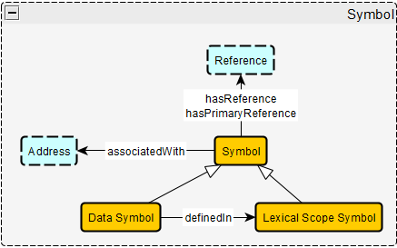
### Axioms
* `Symbol hasReference min 0 Reference`  
"A symbol has 0 or more references"
* `Symbol hasPrimaryReference min 0 max 1 Reference`  
"A symbol has up to one primary reference"
* `Symbol associatedWith Address exactly 1 Address`  
"A symbol is associated with exactly 1 address"
* `Data Symbol subClassOf Symbol`  
"Every Data Symbol is a Symbol"
* `Lexical Scope Symbol subClassOf Symbol`  
"Every Lexical Scope Symbol is a Symbol"
* `Data Symbol definedIn Lexical Scope Symbol min 0 Symbol`  
"Every data symbol is defined in 0 or more Lexical Scope Symbols"  
* `Data Symbol definedIn namespace exactly 1 namespace`  
"Every data symbol is defined in exactly 1 namespace"

## Reference
### Description
A reference is where two memory addresses interact in some way with each other, where one address uses another. This is used for things like when a function calls another function or when data is accessed by an instrution. References are 4-tuples, which include the source address, destination address, the type of reference (function call, data being accessed, etc.), and the operand index (which is an int that is either -1, 0, or 1).

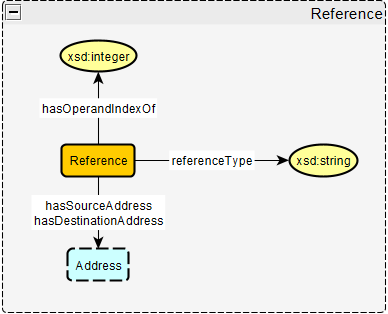
### Axioms
* `Reference hasSourceAddress address exactly 1 sourceAddress`  
"A reference has exactly one source address"
* `Reference hasDestinationAddress address exactly 1 destinationAddress`  
"A reference has exactly one destination address"
* `Reference hasType xsd:string exactly 1 type`  
"A reference has exactly one reference type indicated by a string"
* `Reference hasOperandIndex xsd:integer exactly 1 index`  
"A reference has exactly one operand index indicated by an integer"

## Address
### Description
An object that holds the Memory address of a given symbol. It's an object itself so it can point to other objects.

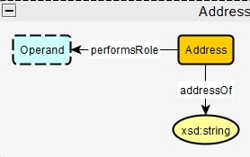

### Axioms
* `Address addressOf xsd:string`  
"An address refers to a memory address represented by a string"
* `Address performsRole Operand min 0 Operand`  
"An address can perform the role of an operand in an instruction"

## Import/Export
### Description
Imports allow files to use outside functions within the current file through dynamic link libraries (DLLs). Exports allow other files to use the functions from the current file through DLLs. The imports and edxports are important to look at to see if anything imported or exported is either vulnerable or is similar to other malware behavior, as they can direclty affect the safety of the other files in the supplu chain.

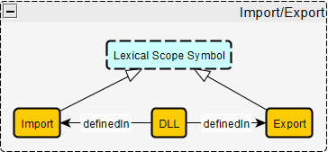
### Axioms
* `Import subClassOf Lexical Scope Symbol`  
"Every import is a lexical scope symbol"
* `Export subClassOf Lexical Scope Symbol`  
"Every export is a lexical scope symbol"
* `DLL definedIn min 0 Imports`  
"Every DLL is defined in 0 or more imports"
* `DLL definedIn min 0 Exports`  
"Every DLL is defined in 0 or more exports"
* `Import hasLabel Label exactly 1 label`  
"Every import has exactly one label"
* `Export hasLabel Label exactly 1 label`  
"Every export has exactly one label"

## Function
### Description
Keeps track of all the aspects of a function, including the variables passed in (parameters), the local variables defined in the function, the return type of the function, the return variable of the function, and the label that the function has.

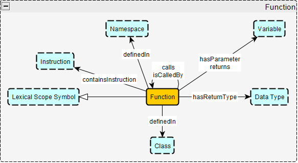

### Axioms
* `Function subClassOf Lexical Scope Symbol`  
"Every function is a lexical scope symbol"
* `Function hasLabel Label exactly 1 label`  
"Every function has exactly one label"
* `Function hasReturnType DataType min 0 max 1 datatype`  
"Every function has either no return type (void) or one return type"
* `Function hasParameter min 0 variable`  
"A function can pass in 0 or more parameters"
* `Function returns min 0 max 1 variable`  
"Every function returns either no variables or one variable"
* `Function calls min 0 Function`  
"A function can call 0 or more other functions"
* `Function calledBy min 0 Function`  
"A function can be called by 0 or more other functions"
* `Function definedIn class min 0 max 1 Class`  
"A function is defined in either 0 or 1 classes"
* `Function definedIn Namespace exactly 1 Namespace`  
"A function is defined in exactly 1 namespace"
* `Function containsInstruction min 1 instruction`  
"A function contains one or more instructions"

## Variable
### Description
Keeps track of all the informtion about a variable, including what kind of variable it is (parameter vs local variable vs global variable), what label it has, and its data type.

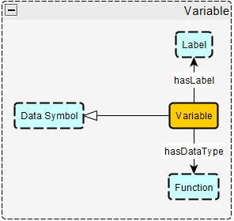
### Axioms
* `Variable subClassOf Data Symbol`  
"Every variable is a data symbol"
* `Variable hasLabel Label exactly 1 Label`  
"Every variable has exactly one label"
* `Variable hasDataType DataType exactly 1 Datatype`  
"Every variable has exactly one data type"

## Data Type
### Description
An object that signifies the data type of a variable, or the return type of a function.

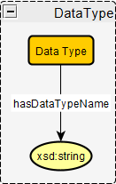

### Axioms
* `Data Type hasDataTypeName xsd:string exactly 1 name`  
"Data type has exactly one data type name indicated by a string"

## Class
### Description

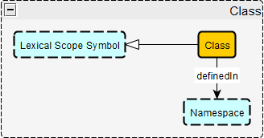

### Axioms
* `Class subClassOf Lexical Scope Symbol`  
"Every class is a lexical scope symbol"
* `Class definedIn Namespace exactly 1 Namespace`  
"A class is defined in exactly 1 namespace"
* `Class hasLabel Label exactly 1 Label`  
"Every class has exactly one label"

## Label
### Description
Contains a human readable label for a symbol (function, variable, etc.). Contains the string of the name of the label and the memory address the label points to.

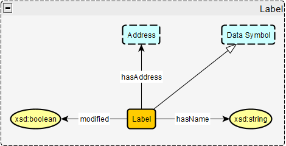
### Axioms
* `Label subClassOf Data Symbol`  
"Every label is a data symbol"
* `Label hasName xsd:string exactly 1 name`  
"Every label has exactly one name indicated as xsd:string"
* `Label hasAddress Address exactly 1 address`  
"Every label has exactly one memory address"
* `Label modified xsd:boolean`  
"A label has a value modified that is either true or false"  
(If the user modifies the name of a label, this will be set to true.)

## Namespace
### Description
Namespaces group together symbols like functions and classes to make sure there is no naming conflicts within the same scope. Namespaces can hold functions, variables, classes, and other namespaces. Namespaces cannot share names, and classes cannot share names with namespaces.

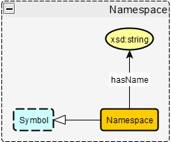
### Axioms
* `Namespace subClassOf Lexical Scope Symbol`  
"Every namespace is a lexical scope symbol"
* `Namespace hasName xsd:string exactly 1 name`  
"Every namespace has exactly one name indicated by xsd:string"

## Instruction
### Description
Assembly instructions that come from Ghidra's disassembly from an executable file. 

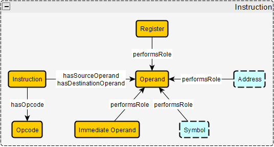

### Axioms
* `Instruction hasOpcode exactly 1 Opcode`  
"Every instruction has exactly 1 opcode"
* `Instruction hasSourceOperand min 0 Operand`  
"Every instruction has 0 or more source operands"
* `Instruction hasDestinationOperand min 0 max 1 Operand`  
"Every instruction has exactly 0 or 1 destination oeprands"
* `Address performsRole Operand`  
"An address can perform the role of an operand"
* `Register performsRole Operand`  
"A register can perform the role of an operand"
* `ImmediateOperand performsRole Operand`  
"An immediateOperand can perform the role of an operand"
* `Symbol performsRole Operand`  
"A symbol can perform the role of an operand"

## Overall Schema Diagram
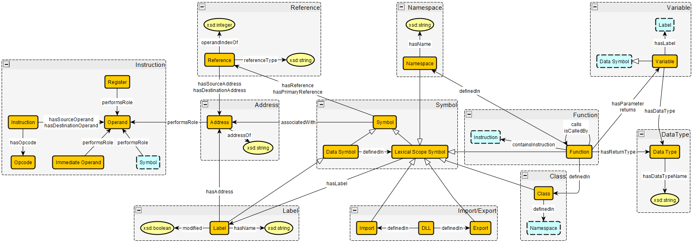