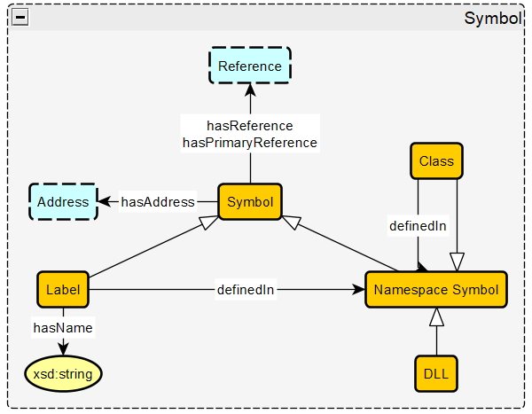
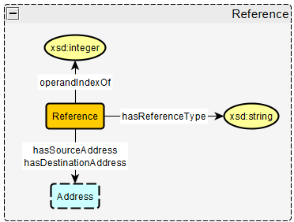
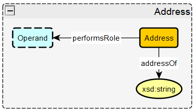
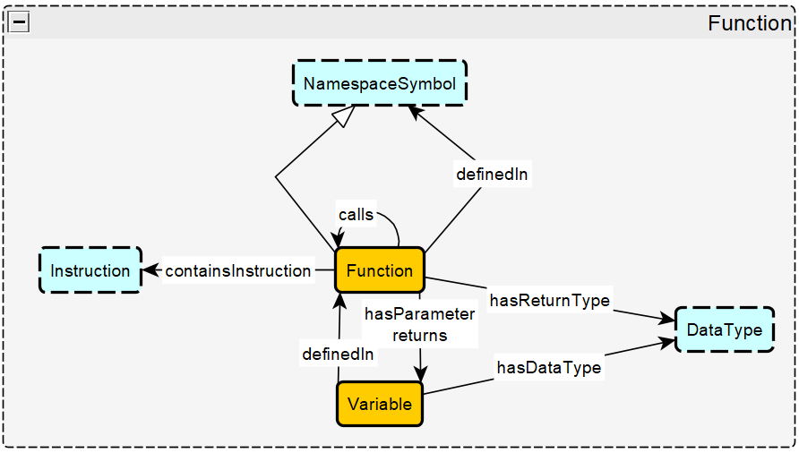
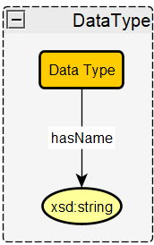
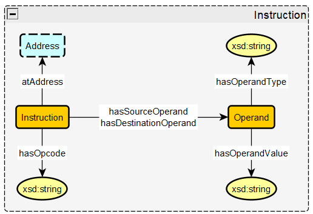
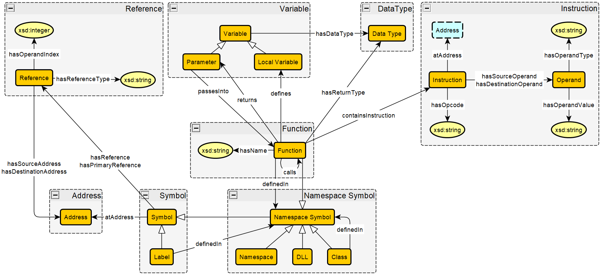

# Key Notions (Modules)

## Symbol
### Description
A symbol is a named entity in an executable file that is associated with a specific memory address. For this schema, the types of symbols include labels, then a sub class of symbol called namesapce symbol, which includes functions, classes, namespaces, and DLLs (dynamic link library). A symbol can have one or more references, but only one reference is designated as the primary reference.

### Axioms
* `(1) Symbol hasReference min 0 Reference`  
"A symbol has 0 or more references"
* `(2) Symbol hasPrimaryReference min 0 max 1 Reference`  
"A symbol has up to one primary reference"
* `(3) Symbol hasAddress Address exactly 1 Address`  
"A symbol is associated with exactly 1 address"
* `Label subClassOf Symbol`  
"Every label is a symbol"
* `Namespace Symbol subClassOf Symbol`  
"Every namespace symbol is a symbol"
* `Class subClassOf Namespace Symbol`  
"Every class is a namespace symbol"
* `DLL subClassOf Namespace Symbol`  
"Every dll is a namespace symbol"
* `(4) Label definedIn Namespace Symbol exactly 1 Namespace Symbol`  
"Every label is defined in exactly one namespace symbol" 
* `(5) Class definedIn Namespace Symbol exactly 1 Namespace Symbol`  
"Every class is defined in exactly one namespace symbol"

## Reference
### Description
A reference is where two memory addresses interact with each other in some way, where one address uses another. This is used for things like when a function calls another function or when data is accessed by an instrution. References are 4-tuples, which include the source address, destination address, the type of reference (function call, data being accessed, etc.), and the operand index (which is an int that is either -1, 0, or 1).  

### Axioms
* `(#) Reference hasSourceAddress address exactly 1 sourceAddress`  
"A reference has exactly one source address"
* `(#) Reference hasDestinationAddress address exactly 1 destinationAddress`  
"A reference has exactly one destination address"
* `(#) Reference hasType xsd:string exactly 1 type`  
"A reference has exactly one reference type indicated by a string"
* `(#) Reference hasOperandIndex xsd:integer exactly 1 index`  
"A reference has exactly one operand index indicated by an integer"
## Address
### Description
An address is the memory address that holds the data of a given symbol. It is considered an object in this schema so it can be referenced, while also be used as an operand in assmebly instructions. The address itself is stored as a string.  

### Axioms
* `(#) Address addressAsString xsd:string`  
"An address refers to a memory address represented by a string"
* `(#) Address performsRole Operand min 0 Operand`  
"An address can perform the role of an operand in an instruction"
## Function
### Description
The Function objects keeps track of all the aspects of a function, including any functions it calls or functions called by it, the variables passed in (parameters), the local variables defined in the function, the return type of the function, the return variable of the function, the instructions the function contains, and what class the function is contained in (if any).

### Axioms
* `Function subClassOf Namespace Symbol`  
"Every function is a lexical scope symbol"
* `(#) Function hasReturnType Data Type min 0 max 1 datatype`  
"Every function has either no return type (void) or one return type"
* `(#) Function hasParameter min 0 variable`  
"A fuction can pass in 0 or more parameters"
* `(#) Function returns min 0 max 1 variable`  
"Every function returns either no variables or one variable"
* `(#) Function calls min 0 Function`  
"A function can call 0 or more other functions"
(calledBy is the inverse of calls)
* `(#) Function definedIn Namespace Symbol Exactly 1 Namespace Symbol`  
"A function is defined in exactly one lexical scope symbol"
* `(#) Function containsInstruction min 1 instruction`  
"A function contains one or more instructions"

## Data Type
### Description
The data type object signifies the data type of a variable or the return type of a function. The name of the data type is specified via string.
### Axioms
* `(#) Data Type hasName xsd:string exactly 1 name`  
"Data type has exactly one data type name indicated by a string"

## Class
### Description
The class objects keeps track of information about a given class. It is defined within a namespace, and variables and functions are defined within the class.
<!-- image -->
### Axioms
* `Class subClassOf Namespace Symbol`  
"Every class is a namespace symbol"
* `(22) Class definedIn Class min 0 max 1 Class`  
"A class is defined in 0 or 1 namespace"
* `(23) Class definedIn Namespace min 0 max 1 Namespace`  
"A class is defined in 0 or 1 namespace"
(A class must be defined in either one class or one namespace, not both or neither.)

## Namespace
### Description
Namespaces group together symbols like functions and classes to make sure there is no naming conflicts within the same scope. Namespaces can hold functions, variables, classes, and other namespaces. Namespaces cannot share names, and classes cannot share names with namespaces.
<!-- image -->
### Axioms
* `Namespace subClassOf Namespace Symbol`  
"Every namespace is a namespace scope symbol"
* `(26) Namespace hasName xsd:string exactly 1 name`  
"Every namespace has exactly one name indicated by xsd:string"

## Instruction
### Description
The instruction object refers to an assembly instruction that will originate from the disassembly acquired from Ghidra from a given executable file. An instruction includes one opcode, and one or more operands, where registers, immediate operands (constant values), addresses, or symbols can play the role of an operand.
Assembly instructions that come from Ghidra's disassembly from an executable file. 

### Axioms
* `(#) Instruction hasOpcode exactly 1 Opcode`  
"Every instruction has exactly 1 opcode"
* `(#) Instruction hasSourceOperand min 0 Operand`  
"Every instruction has 0 or more source operands"
* `(#) Instruction hasDestinationOperand min 0 max 1 Operand`  
"Every instruction has exactly 0 or 1 destination oeprands"
* `(#) Address performsRole Operand`  
"An address can perform the role of an operand"
* `(#) Register performsRole Operand`  
"A register can perform the role of an operand"
* `(#) ImmediateOperand performsRole Operand`  
"An immediateOperand can perform the role of an operand"
* `(#) Symbol performsRole Operand`  
"A symbol can perform the role of an operand"

## Overall Schema Diagram
